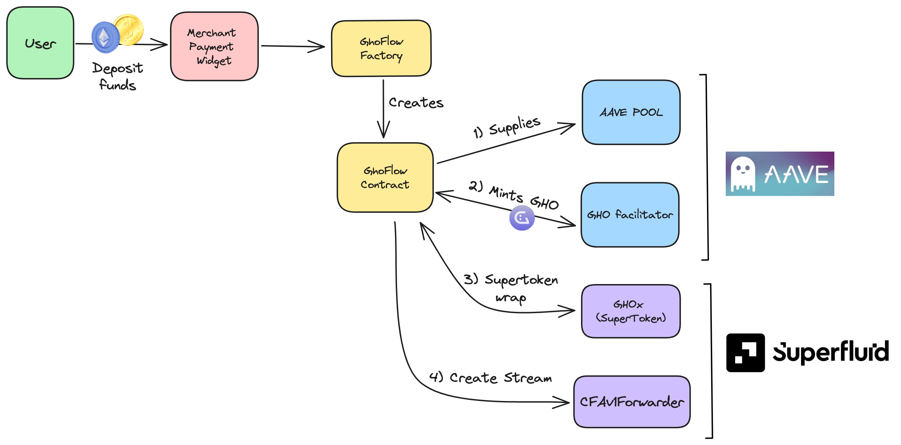
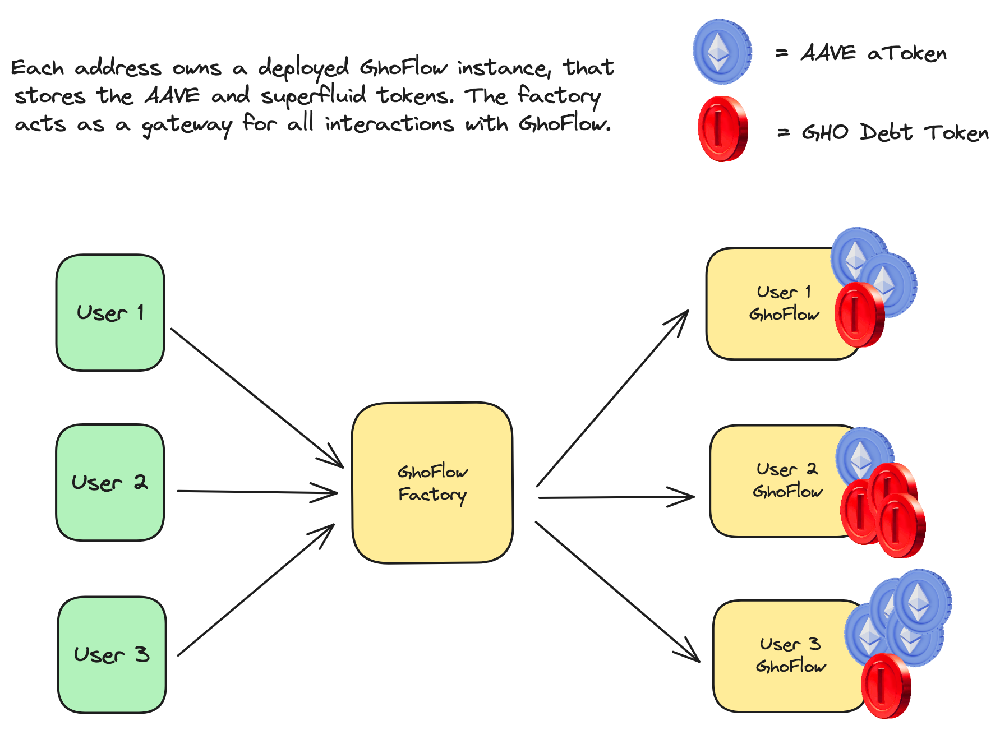

# GhoFlow - LFGHO 2024

  

## Summary

A merchant wants to sell subscriptions - and recieve the payment in a constant flow of stablecoins. A user wants to buy such subscription, but without having to swap his/her assets. 

GhoFlow allows the merchant to have a payment widget, streamlines the whole process in 1 transaction (if using ETH for credit, 2 if some token), leveraging AAVE lending pools, stablecoin GHO and Superfluid for the payment streams!

## Deployed contracts

| Network | Address | Etherscan Verified |
| --------------- | --------------- | --- |
| Sepolia  | [0x31554a01faEdDFDe645D6BDd8f810CBF1D180fA8](https://sepolia.etherscan.io/address/0x31554a01faEdDFDe645D6BDd8f810CBF1D180fA8)  | :white_check_mark:  |

## Description

If a user would like to pay a merchant in a stream of a stablecoin, the steps would be:

1) Deposit ETH or tokens (with prior approval) into AAVE pool.
2) Borrow GHO against the collateral.
3) Wrap GHO into superfluid token GHOx.
4) Approve superfluid allowance for GHOx.
5) Go to superfluid dashboard and create a stream with the right flowrate.

These are **5-6 transactions** (depending if the user deposits ETH or Tokens), and the user needs to know all of these protocols - **not great for adoption**.

GhoFlow comes to the rescue! The merchant sets up the widget in the checkout, with whatever is the subscription price, and BAM! in a single transaction, the user creates a stream of GHO into the merchants wallet. 

## Features

- Supports ETH or Tokens as collateral (At the moment in sepolia, support for DAI and AAVE).
- Master contract GhoFlowFactory deploys a new instance of GloFlow for each sender address.
    - This deployment is a one time thing.
    - This contract acts as a vault for the AAVE asset tokens and GHO debt from minting debt. This way, if an address repays its GHO debt, it can withdraw its supplied assets + accured interest (calculated from the aToken balance).
- A user can create new streams without having to supply assets again, if there is enough collateral to do so.

## Protocol Diagrams

A general overview of the whole deposit to stream creation:

A view of the GhoFlow contract architecture and where the asset and debt tokens are held:

## Limitations

- At the moment, superfluid only handles 1 stream for every sender/receiver pair. So if a second stream tries to be created, it will fail. A bypass is simply to update the stream increasing the flowRate.
